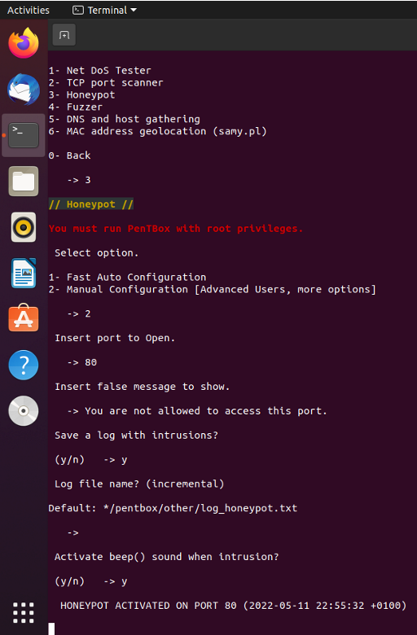
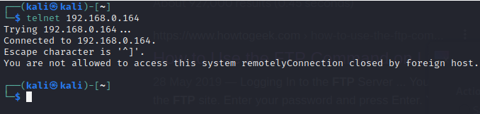

## **Honeypot**

A honeypot can be hardware or software set up to attract threat actors, with the intention of analyzing attack strategies and tools, to provide early warnings of attack attempts, or possibly as a decoy to divert attention from actual computer systems. Another use is to detect internal fraud, snooping, and malpractice.

Many honeypots are set up by security researchers investigating malware threats, software exploits, and spammers' abuse of open relay mail systems. These systems are generally fully exposed to the Internet.

### Different types of honeypot tech

Several honeypot technologies in use include the following; malware honeypots, spam honeypots, database honeypot, client honeypots.

## **Benefits of a honeypot**

Honeypots provide lot of security benefits, the followings are part of them:

1. They break the attacker kill chain and slow attackers down: Malicious actors can also spend a significant amount of time trying to work on the honeypot instead of going after areas that have real data. Diverting their attack to a useless system wastes cycles and gives you early warning of an attack in progress.

1. They capture vital data: The IP address of the threat actor, date and time of the intrusion event, keystrokes entered and typed by the attacker, the type of data that the attacker had accessed, modified or that was deleted, the usernames and different privileges used by the attacker.

1. They are straightforward and low-maintenance: Modern honeypots are not only easy to download and install, but can provide accurate alerts around dangerous misconfigurations and attacker behavior. 

1. They help you test your incident response processes: Honeypots are a low-cost way to help you increase your security maturity, as they test whether your team knows what to do if a honeypot reveals unexpected activity. Can your team investigate the alert and take appropriate countermeasures?

Honeypot can be installed on a Linux machine, windows machine, MACOS as well. I will install Pentbox as honeypot on Linux machine to demonstrate how it works. The linux machine used for this demonstration is Ubuntu.

For this demonstration, 

* _Kali Linux  ===>     Attacking machine_
* _Ubuntu     ===>    Target machine_

Check the IP address of your Ubuntu machine using ifconfig. The IP address is 192.168.0.164.

Ensure the ubuntu machine and the attacking machine (Kali Linux) are on the same network system.
Arp-scan was run on the attacking machine to discover other machines/systems on the same network with the Kali machine. 
Run nmap scan on the ubuntu IP address to see if any port is open. In this case, all the 1000 ports are closed.
The nmap was run when the honeypot (pentbox) was not installed on the target machine.

Open the terminal on the target machine and Install pentbox using this link below;

wget http://downloads.sourceforge.net/project/pentbox18realised/pentbox-1.8.tar.gz

Use the tar command to decompress the downloaded file. 

`tar -zxvf pentbox-1.8.tar.gz`

After decompressing the file, we now have new directory pentbox-1.8. 
Change directory to pentbox-1.8 to see files and directories in it.
The pentbox software is the one with the .rb extension. Run it using ./

`./pentbox.rb`

The first one I ran did not work because It requires root privileges before you can run it.

sudo ./pentbox.rb

Enter 3 to select honeypot.

Enter 2 to select manual configuration, so that can specify the port to be used.
FTP port was used in this case, so port 21 was entered. 
Enter the message to be displayed to the attacker when he access the FTP server.
"You are not allowed to access this system remotely"
Enter y as yes to allow a log to be saved when intrusions occur. 
The default log file was used, log_honeypot.txt.
You can enable sound alert if you want to be alerted whenever intrusion occurs.

Run nmap scan again on the attacking machine against the target IP address.
The FTP port is open. Connect to the ftp server.

The connection was established and the pentbox detected the intrusion on the target machine. 
The intrusion event was saved on log file which was saved on the log file, log_honeypot.txt.

The intrusion recorded on the log file. The attacker's IP address with the date and time the intrusion occurred.

### **HTTP SERVER**

Using http port as decoy port, http port 80 was configured as the decoy port.
Other entries were used as in previous steps.

Run nmap scan again on the attacking machine against the target IP address.
The http port is open. Connect to the http server.

Go to the url http://192.168.0.164

The connection was established and the pentbox detected the intrusion on the target machine. 
The intrusion event was saved on log file, log_honeypot.txt.
The false message can also be seen, "You are not allowed to access this port".

The intrusion event, the user-agent (mozilla/5.0) used to access the http server was logged and the IP address of the attacker machine.

### **Telnet**
Using telnet port as decoy port, telnet port 23 was configured as the decoy port.
Other entries were used as in previous steps.

Run nmap scan on the attacking machine against the target IP address.
The telnet port is open. Connect to the telnet server.

The connection was established and the pentbox detected the intrusion on the target machine. 
The intrusion event was saved on log file, log_honeypot.txt.
The false message can also be seen, "You are not allowed to access this system remotely".

The intrusion event details were logged; date and time, attacker IP address.

